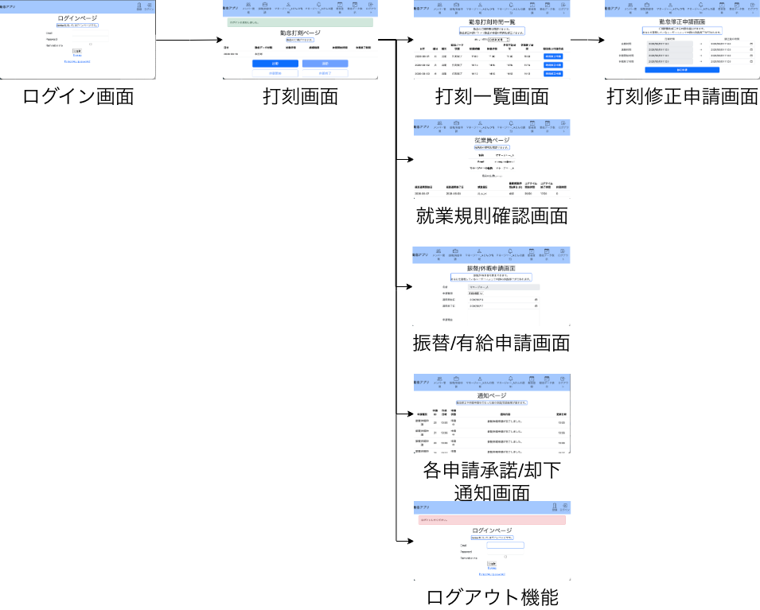
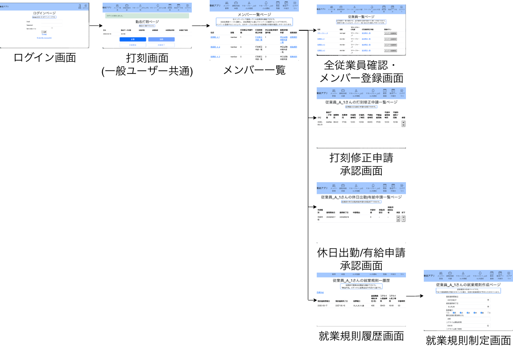
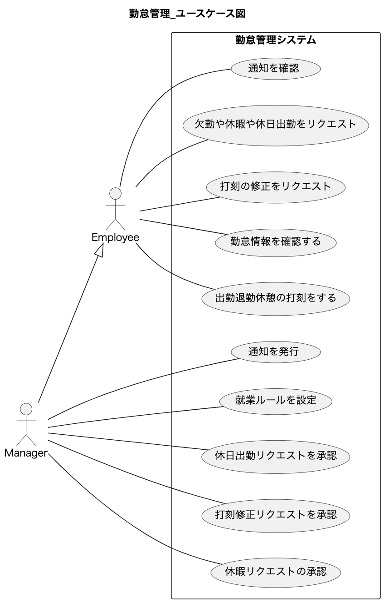

# Kintai-Worktime

Rails を用いた勤怠管理アプリ
学習用です。

勤怠管理が可能な簡易的な業務アプリです。

## URL

準備中

## 作成背景

・Ruby学習のため

・今後Railsを用いた業務アプリケーションを作成する際に、この勤怠管理アプリを制作した経験が活かせると感じたから。

## 機能一覧

- ユーザー登録、ログイン機能(device)

- 一般ユーザーの機能

  - 勤怠登録
    - 出勤、退勤、休憩開始、休憩終了の打刻機能
    - 押し間違えた5分以内の打刻の消去機能
    - 押し間違えた打刻の修正申請機能

  - 自身の情報確認
    - 登録名やメールアドレスの確認
    - 与えられた就業ルールの確認
      - 出勤する曜日の確認
      - コアタイム・休憩時間上限を確認

  - 振替出勤/休暇申請
    - 振替出勤、有給休暇、病欠を理由とした例外日の申請機能

  - 通知機能
    - 各申請の承認/却下確認のための通知機能

- マネージャー権限を持つユーザーの管理機能
  - ユーザーの情報確認
    - ユーザーの登録名やメールアドレスの確認
  
  - メンバー管理(ユーザーをメンバーとして登録可能)
    - メンバーの打刻修正申請の承認/却下機能
    - メンバーの振替/休暇申請の承認/却下機能
    - メンバーの就業規則の更新機能

## 一般ユーザー/管理者の画面遷移図

## 管理者の画面遷移図

## テスト

- RSpec
  - 単体テスト(spec/model)
  - 結合テスト(spec/requests)

## 使用技術

(2026-6-18現在)
- Ruby 4.0.1
- Ruby on Rails 8.1.3
  - RSpec 3.13.6
  - devise 5.0.4
  - kaminari 1.2.2
- Bootstrap 5.3.8
- PostgreSQL 18.3

## 設計

