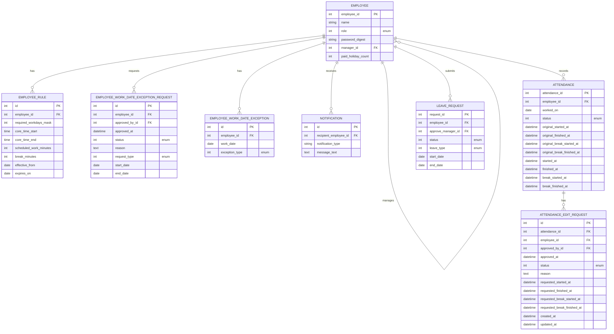

# クラス図

```mermaid
erDiagram
    EMPLOYEE {
        int employee_id PK
        string name
        int role "enum"
        string password_digest
        int manager_id FK
        int paid_holiday_count
    }

    EMPLOYEE_RULE {
        int id PK
        int employee_id FK
        int required_workdays_mask
        time core_time_start
        time core_time_end
        int scheduled_work_minutes
        int break_minutes
        date effective_from
        date expires_on
    }

    EMPLOYEE_WORK_DATE_EXCEPTION_REQUEST {
        int id PK
        int employee_id FK
        int approved_by_id FK
        datetime approved_at
        int status "enum"
        text reason
        int request_type "enum"
        date start_date
        date end_date
    }

    EMPLOYEE_WORK_DATE_EXCEPTION {
        int id PK
        int employee_id FK
        date work_date
        int exception_type "enum"
    }

    NOTIFICATION {
        int id PK
        int recipient_employee_id FK
        string notification_type
        text message_text
    }

    ATTENDANCE {
        int attendance_id PK
        int employee_id FK
        date worked_on
        int status "enum"
        datetime original_started_at
        datetime original_finished_at
        datetime original_break_started_at
        datetime original_break_finished_at
        datetime started_at
        datetime finished_at
        datetime break_started_at
        datetime break_finished_at
    }

    ATTENDANCE_EDIT_REQUEST {
        int id PK
        int attendance_id FK
        int employee_id FK
        int approved_by_id FK
        datetime approved_at
        int status "enum"
        text reason
        datetime requested_started_at
        datetime requested_finished_at
        datetime requested_break_started_at
        datetime requested_break_finished_at
        datetime created_at
        datetime updated_at
    }

    LEAVE_REQUEST {
        int request_id PK
        int employee_id FK
        int approve_manager_id FK
        int status "enum"
        int leave_type "enum"
        date start_date
        date end_date
    }

    EMPLOYEE ||--o{ EMPLOYEE : "manages"
    EMPLOYEE ||--o{ EMPLOYEE_RULE : "has"
    EMPLOYEE ||--o{ EMPLOYEE_WORK_DATE_EXCEPTION_REQUEST : "requests"
    EMPLOYEE ||--o{ EMPLOYEE_WORK_DATE_EXCEPTION : "has"
    EMPLOYEE ||--o{ NOTIFICATION : "receives"
    EMPLOYEE ||--o{ ATTENDANCE : "records"
    EMPLOYEE ||--o{ LEAVE_REQUEST : "submits"
    ATTENDANCE ||--o{ ATTENDANCE_EDIT_REQUEST : "has"
```