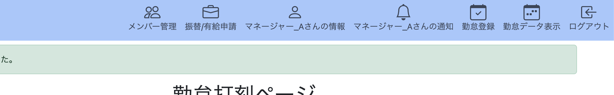
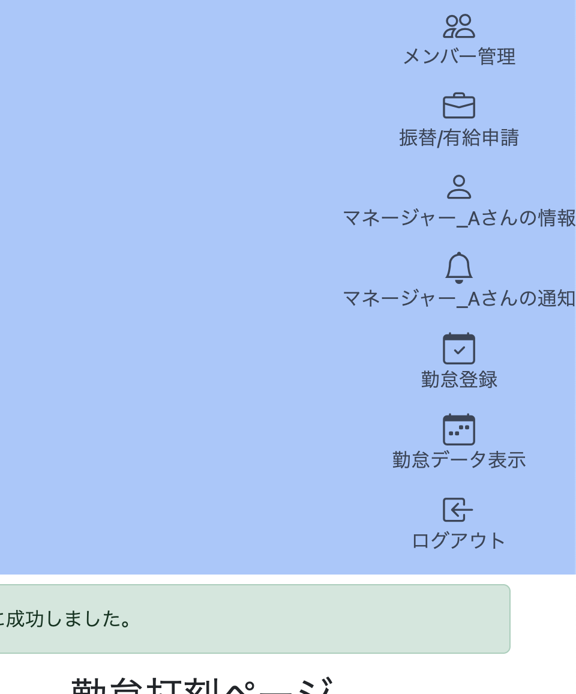

# 勤怠管理アプリ_改良草案

## 概要

勤怠管理アプリの改善案を決めるファイルです。

## 課題

### アプリ内の課題

- コードが煩雑
  - viewでの実装が統一されていない。I18n(多言語)に対応した記述もあれば、そのまま日本語を埋め込んでる記述もあったり。
  - MVCの責務分離が不十分。view層でデータを加工している記述が残っている。

- UIが不完全
  - ヘッダーアイコンが現状並べただけであり、画面が小さいとアイコンが縦列になる。その分画面を占有してしまい、使いづらくなる。
  
  **↑アイコンが横に並んで問題ない画面**
  
  **↑画面が狭くアイコンが縦に並んでしまう画面**
  - 画面いっぱいに表示されている
    - Bootstrapのテーブル機能を用いた実装を見直す
- 通知機能が簡易的
  - 「申請承諾」「申請否決」といった結果通知をテキストで表示するのみで、申請修正などに遷移できない。

- 有給管理がかなり簡易的
  - 有給付与、消化の際の有給をカウントする機能が未実装。
- 残業機能がない

### アプリ外の課題

- githubの使い方が我流
  - issueを使っていない
  - プッシュのコメントを雰囲気で書いている(ルールがない)

- Qiitaに記事を1個しか上げられていない
  - 活動実態が見えにくい

## 改良内容

### 機能要件

<!-- ユーザーが利用できるようにする機能を記載する -->

- 勤怠実績をグラフ表示する

### 画面・操作の変更

<!-- 追加・変更する画面や操作方法を記載する -->

- 

### データベースの変更

<!-- 追加・変更するテーブル、カラム、関連などを記載する -->

### 非機能要件

- エラー画面の追加

## 実装手順

1. 
2. 
3. 

## 懸念点・未決定事項

<!-- 調査や相談が必要な点を記載する -->

- [ ] 

## 今後の拡張案

<!-- 今回は実装しないものの、将来検討したい内容を記載する -->

- 